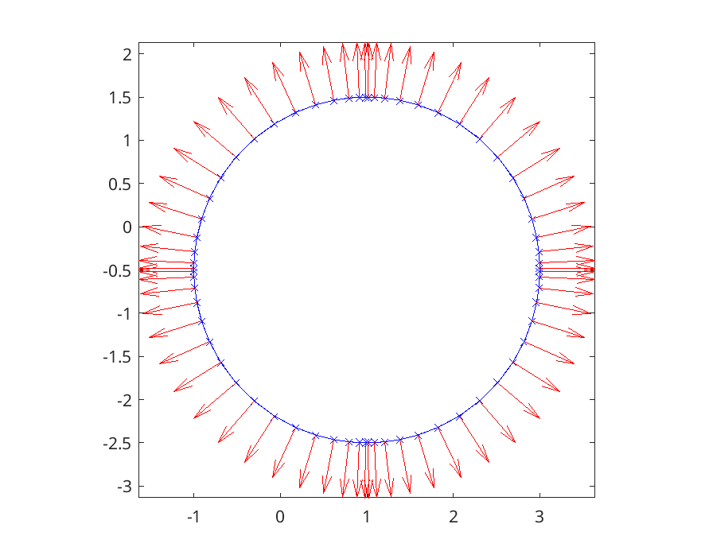
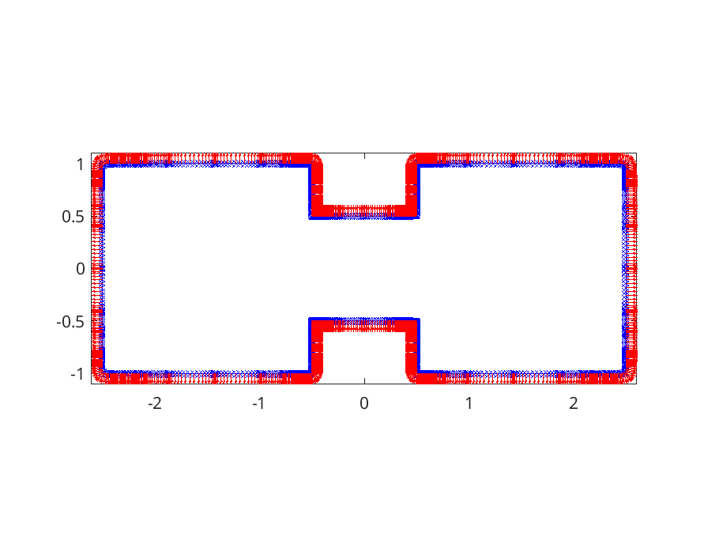
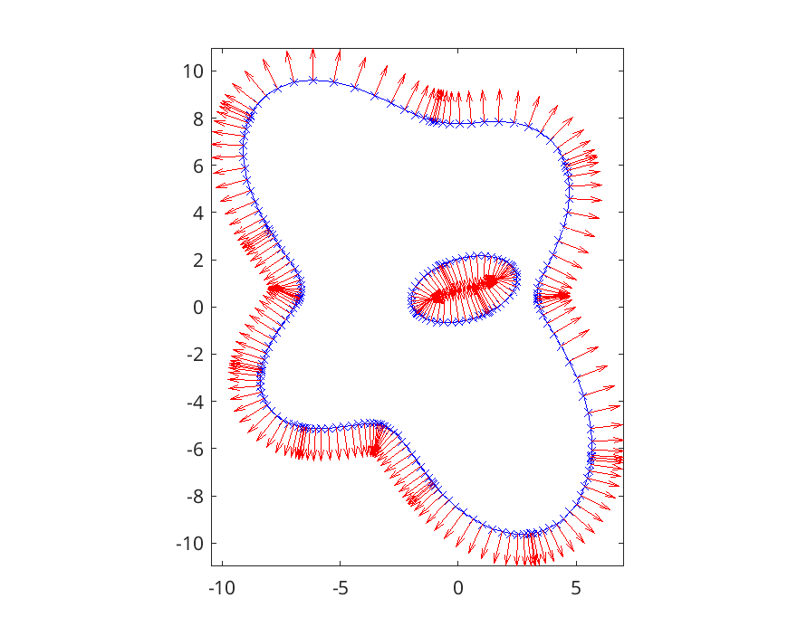
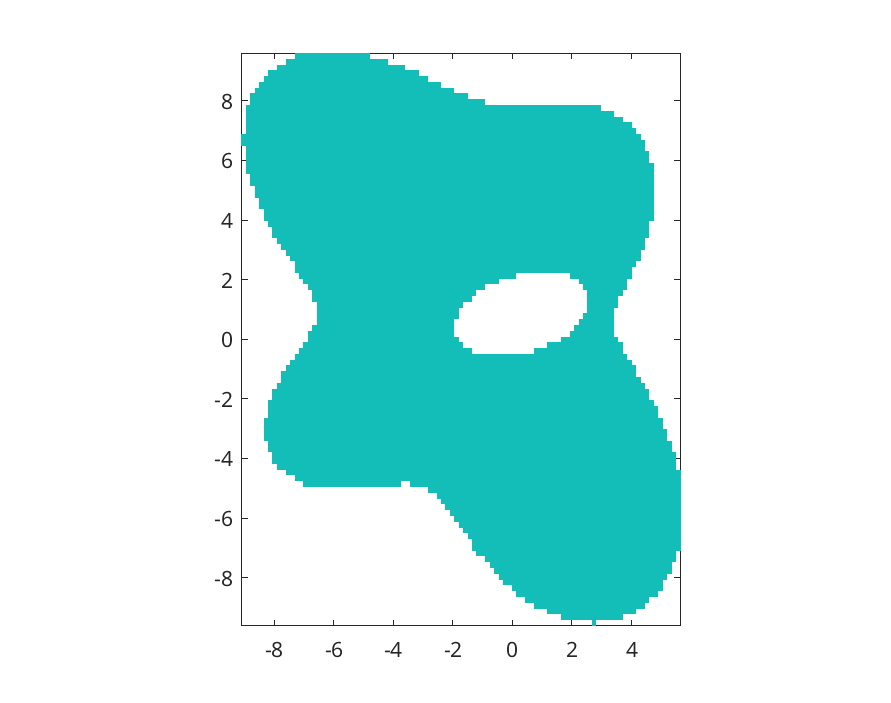

.. role:: matlab(code)
   :language: matlab   

Curve Discretization with Chunkers
===================================

In chunkie, a smooth, regular curve is discretized by dividing
it into pieces, called "chunks", which are then represented
by polynomial interpolants at scaled Legendre nodes. This
information is stored in a :matlab:`chunker` object.

Creating a Chunker
-------------------

A chunker object can be obtained from a curve parameterization
using the function :matlab:`chunkerfunc`. The :matlab:`chunker`
class overloads some MATLAB commands, like :matlab:`plot` and
:matlab:`quiver`, to simplify common visualization tasks. The
code below creates a :matlab:`chunker` object for a circle and
plots the geometry and the normal vectors.

.. include:: ../../chunkie/guide/guide_chunkers.m
   :literal:
   :code: matlab
   :start-after: % START CIRCLE
   :end-before: % END CIRCLE
	  

.. note::
	   
   The chunkerfunc routine expects a specific format for the curve
   parameterization function. In particular, if :matlab:`fcurve`
   is a MATLAB function defining the curve parameterization and
   :matlab:`t` is a vector of points in parameter space, then
   :matlab:`r = fcurve(t)` should be a matrix in which :matlab:`r(:,j)`
   contains the :math:`(x,y)` coordinates of the point on the
   curve corresponding :matlab:`t(j)`.

   If the output of :matlab:`fcurve`
   is of the form :matlab:`[r,d] = fcurve(t)` or
   :matlab:`[r,d,d2] = fcurve(t)`, then :matlab:`d` and :matlab:`d2`
   are assumed to be first and second derivatives, respectively,
   of the position with respect to the underlying parameterization.
   Providing these values can improve the convergence rate and
   precision achieved in integral equation calculations.

Some utilities are provided that define a family of
parameterized curves:

.. include:: ../../chunkie/guide/guide_chunkers.m
   :literal:
   :code: matlab
   :start-after: % START MORE PARAMS
   :end-before: % END MORE PARAMS

|pic1|  |pic2|

Given a set of vertices, a rounded polygon can be defined:

.. include:: ../../chunkie/guide/guide_chunkers.m
   :literal:
   :code: matlab
   :start-after: % START ROUNDED POLY
   :end-before: % END ROUNDED POLY

Working with Chunkers
----------------------

Instances of :matlab:`chunker` objects can be manipulated in
several ways. 
Users are free to update the position and derivative
fields of :matlab:`chunker` objects, though the software will
not check whether the user has done this in a consistent
manner. 

The example below takes the circle and random mode domains
created above and creates a new domain from them with
multiple components. The random mode domain is rotated and
the circle is shifted and its orientation is reversed, so
that the normal for the combined domain consistently points out
of the interior. 

.. include:: ../../chunkie/guide/guide_chunkers.m
   :literal:
   :code: matlab
   :start-after: % START SHIFT AND REVERSE
   :end-before: % END SHIFT AND REVERSE

It is also possible to find the points on the interior of a
:matlab:`chunker` object, which is convenient in many plotting
tasks:

.. include:: ../../chunkie/guide/guide_chunkers.m
   :literal:
   :code: matlab
   :start-after: % START INTERIOR
   :end-before: % END INTERIOR

.. note::

   In the example above, it is crucial that the orientation
   of the circle was reversed so that the combined domain
   had consistent normals, i.e. so that the normals
   all pointed out of the interior. Without doing this,
   the :matlab:`chunkerinterior` function will fail.
	   
There is more available. The :matlab:`chunker` class documentation
gives a survey of the available methods:

.. include:: ../../chunkie/@chunker/chunker.m
   :literal:
   :code: matlab
   :start-after: classdef chunker
   :end-before: % author

.. note::

   To obtain the documentation of a class method which has
   overloaded the name of a MATLAB built-in, use the syntax
   :matlab:`help class_name/method_name`. For example:

   .. code:: matlab

      help chunker/area
