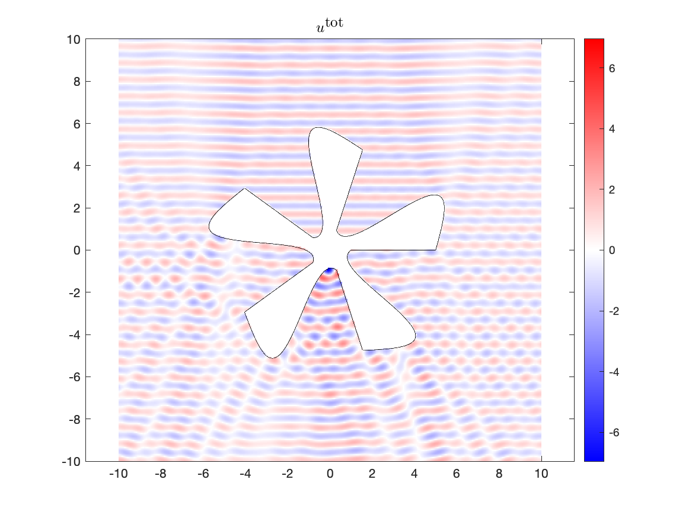

.. role:: matlab(code)
   :language: matlab   

Boundary Value Problems on Chunkgraphs
=========================================
The solution and behavior of integral equations on :matlab:`chunkgraphs` 
differs from that on :matlab:`chunkers` in one major way, the solutions
on domains with corners and multiple junctions tend to be singular 
and require additional care for their accurate computation. 

For concreteness, suppose that $\Gamma$ is the boundary described via a 
:matlab:`chunkgraph`, and consider the following second kind integral equation
for a density $\sigma$ 

.. math::

   \sigma(x) + \int_{\Gamma} K(x,y) \sigma(y) ds(y) = f(x)\;, \quad x \in \Gamma \,.

If $(0,0)$ is a vertex on $\Gamma$, then for $x\in \Gamma$ in the
vicinity of the corner, $\sigma$ is well-approximated by functions
of the form $|r|^{\mu} \log{r}^{\eta}$ where $r=|x|$, $\mu \in \mathbb{C}$ 
with $\textrm{Re}(\mu) > -1$ and $\eta \in \mathbb{R} > 0$. For example, 
for the Laplace and Helmholtz Neumann boundary value problem, 
$\mu \in \mathbb{R} > -1/2$. The approximation of  
such functions with Gauss-Legendre panel based discretizations to a tolearance
of $\varepsilon$ could require a dyadic grid in the vicinity of the corner
with the smallest panel scaling as $O(1/\varepsilon^2)$. 

There are several standard approaches which 
compress the interactions in the vicinity of the corner
with the rest of the boundary. In chunkIE, we use the 
`Recursively compressed inverse preconditioning` (RCIP) approach for 
addressing this issue, since it is robust, capable of achieving high accuracy,
kernel indpendent and requires only a quadrature rule for handling the near
singular nature of the kernel ignoring the singular behavior of the
density. Briefly, it constructs an effective matrix of interaction
corresponding to the two panels in the vicinity of the corner, by 
recursively compressing the corner interactions on a heirarchy of dyadic
grids. While a dyadic mesh is used to construct the effective matrix 
of interaction, the density $\sigma$ is described by its samples on 
two Gauss-Legendre panels in the vicinity of the corner. For a detailed
description of the RCIP method, see the wonderful tutorial by Johan
Helsing who has been the chief architect of the RCIP approach, [Hel2012]_. 

However, the chunkIE user does not have to worry about all of these
issues and the routines :matlab:`chunkermat` and :matlab:`chunkerkerneval`
can be seamlessly used for :matlab:`chunkgraphs` with only a minor caveat,
discussed in the note below.

.. note::
   The integral equation *must* be appropriately scaled to ensure that  
   it is of the form $(I + K)$ as opposed to $\alpha I + K$ for $\alpha \neq 1$. 
   The current implementation of the corner compression scheme, 
   RCIP, requires this scaling for solving integral equations on
   `chunkgraphs`. This restriction will soon be lifted in an upcoming release
   of :matlab:`chunkIE`, but is required as of the current version.

A Sound Hard Scattering Problem with Corners
---------------------------------------------

Consider the Helmholtz Neumann scattering problem in the exterior
of a domain with corners. As before, in such a scattering problem, 
an incident field $u^{\textrm{inc}}$ is specified in the exterior
of the object and the scattered field $u^{\textrm{scat}}$ is determined
so that the total field $u = u^{\textrm{inc}} + u^{\textrm{scat}}$ satisfies
the following PDE:

.. math::

   \begin{align*}
   (\Delta + k^2) u^{\textrm{scat}} &= 0 & \textrm{ in } \mathbb{R}^2 \setminus \Omega \; , \\
   \frac{\partial u^{\textrm{scat}}}{\partial n} &= -\frac{\partial u^{\textrm{inc}}}{\partial n} & \textrm{ on } \Gamma \; , \\
   \sqrt{|x|} \left( \frac{x}{|x|} \cdot \nabla u^{\textrm{scat}} - ik u^{\textrm{scat}} \right )
   &\to 0 & \textrm{ as } |x|\to \infty \; ,
   \end{align*}

The Green function for the Helmholtz equation is

.. math::

   G_k (x,y) = \frac{i}{4} H_0^{(1)}( k|x-y|) \; .

This Green function can be used to define
single and double layer potential operators 

.. math::

   \begin{align*}
   [S_{k}\sigma](x) &:= \int_\Gamma G_k(x,y) \sigma(y) ds(y)  \\
   [D_{k}\sigma](x) &:= \int_\Gamma n(y)\cdot \nabla_y G_k(x,y) \sigma(y) ds(y) 
   \end{align*}
   
A robust choice for the layer potential representation for this problem is
a *right preconditioned combined field* layer potential, which is a linear combination
of the single and double layer potentials:

.. math::

   u^{\textrm{scat}}(x) = \beta[(S_{k} + i\alpha D_{k} S_{ik})\sigma](x) \; ,

with $\alpha in \mathbb{R}$ typically chosen to be $|k|$ and
$\beta = -4.0/(2 + i \alpha)$. See [Bru2009]_ for a detailed discussion
on the benefits of using this particular representation for the Helmholtz 
Neumann boundary value problem. The seemingly weird scaling of the integral
representation is to ensure that the eventual integral equation
is of the form $(I+K)$.

Then, imposing the boundary conditions on this representation
results in the equation

.. math::

   \begin{align*}
   -\frac{\partial u^{\textrm{inc}}(x_0)}{\partial n} &= \lim_{x\in \mathbb{R}^2\setminus \Omega, x\to x_0}  \beta[(S_{k} + i\alpha D_{k} S_{ik})\sigma](x) \\
   &= \sigma(x_0) + \beta[S_{k}'\sigma ](x_0) + i\beta \alpha [(D_{k}' - D_{ik}')S_{ik}\sigma](x_{0}) + i \beta \alpha [S_{ik}'S_{ik}'\sigma](x_0) \;,
   \end{align*}

where $S_{k}'$ and $D_{k}'$ represent the normal derivatives of 
the single and double layer potentials respectively, and we have used 
the exterior jump condition for $S_{k}'$ and used Calderon identities
to express $D_{ik}'S_{ik}$ in terms of the identity operator and $S_{ik}'S_{ik}'$.
As before, the integrals in the operators restricted to the boundary must sometimes
be interpreted in the principal value or Hadamard finite-part sense.
The above is a second kind integral equation and is invertible. The integral 
equation as written requires operator composition and RCIP in chunkIE does
not support such operator compositions. However, this is easily remedied
by setting $-[S_{ik}\sigma](x) + \tau(x) = 0$, and 
$-[S_{ik}'\sigma](x) + \mu(x) = 0$ to obtain the following 
system of equations for $\sigma, \tau, and \mu$:

.. math::

   \begin{bmatrix}
   \sigma \\
   \tau \\
   \mu
   \end{bmatrix}
   + 
   \begin{bmatrix}
   \beta S_{k}' & i\beta \alpha (D_{k}'-D_{ik}') & i\beta\alpha S_{ik}' \\
   -S_{ik} & 0 & 0 \\
   -S_{ik}' & 0 & 0
   \end{bmatrix}
   \begin{bmatrix}
   \sigma \\
   \tau \\
   \mu
   \end{bmatrix} = 
   \begin{bmatrix}
   -\frac{\partial u^{\textrm{inc}}}{\partial n} \\
   0 \\
   0
   \end{bmatrix} \; .

Recall that the :matlab:`kernel` class in chunkIE, also allows for the easy
specification of such a matrix of kernels either manually 
or by reinvoking the constructor on a matrix of objects
where each entry of the matrix is a kernel itself. 

Thus implementing this problem remains relatively straightforward as
illustrated below:

.. include:: ../../chunkie/demo/demo_Neumann_combined.m
   :literal:
   :code: matlab
   :start-after: %% Define geometry 
   :end-before: % END DEMO NEUMANN COMBINED 

Mixed Boundary Conditions
--------------------------

.. [Hel2012] Helsing, Johan. "Solving integral equations on piecewise
	     smooth boundaries using the RCIP method: a tutorial." arXiv preprint
	     1207.6737 (2012) 

.. [Bru2009] Helsing, Johan. "Solving integral equations on piecewise
	     smooth boundaries using the RCIP method: a tutorial." arXiv preprint
	     1207.6737 (2012) 
