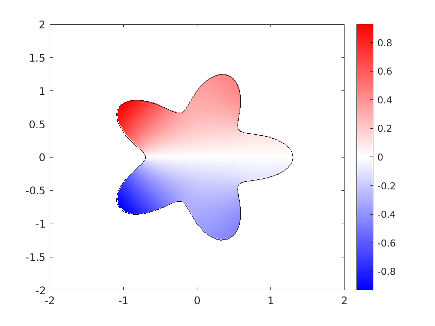
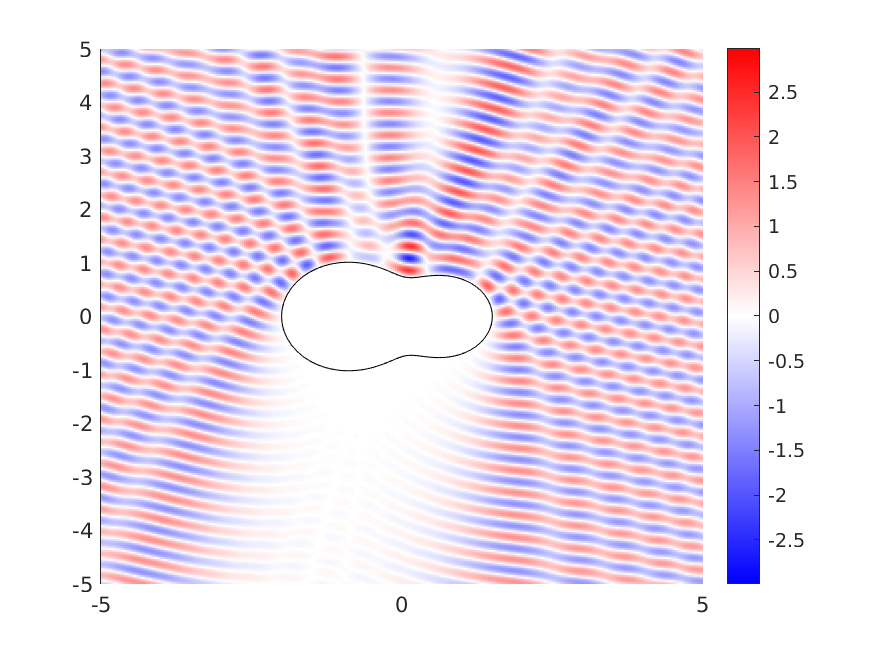
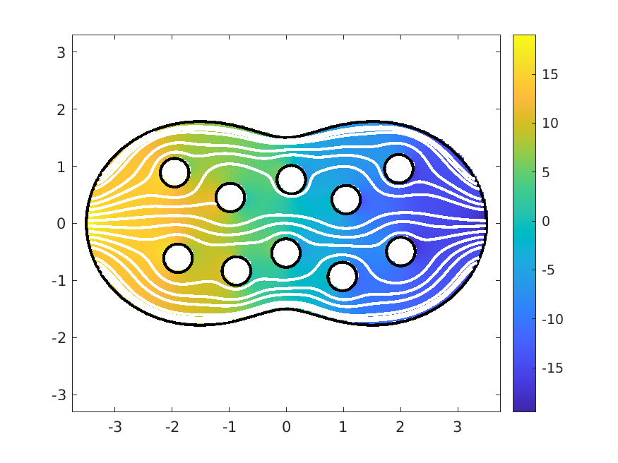

.. role:: matlab(code)
   :language: matlab   

Solving Standard Boundary Value Problems
=========================================

ChunkIE uses the integral equation method to solve PDEs.
In contrast with finite element methods, where the PDE is
typically converted to a weak form, the standard approach for
an integral equation method is to select an integral representation
of the solution that satisfies the PDE inside the domain
*a priori*. This cannot be done for just any PDE; typically,
integral equation methods are limited to constant coefficient,
homogeneous PDEs. But when the methods apply, they are
efficient and accurate.

The following is a very high level discussion of the main ideas.
Some more specific examples are included further below.
For more, see, *inter alia*, [Rok1985]_, [CK2013]_, [GL1996]_, and
[Poz1992]_.

Let :math:`\Omega` be a domain with boundary :math:`\Gamma`.
Suppose that we are interested in the solution of the boundary
value problem

.. math::

   \begin{aligned}
   \mathcal{L} u &= 0 & \textrm{ in } \Omega \; ,\\
   \mathcal{B} u &= f & \textrm{ on } \Gamma \; ,
   \end{aligned}

where :math:`\mathcal{L}` is a linear, constant coefficient PDE
operator and :math:`\mathcal{B}` is a linear trace operator that
restricts :math:`u`, or some linear operator applied to :math:`u`, to the
boundary.

Suppose that :math:`G` is the Green function for :math:`\mathcal{L}`
and let :math:`K` be an integral kernel that is a linear
operator applied to :math:`G`. Then, :math:`u` can be represented
as a *layer potential*, i.e. it can be written in the form

.. math::

   u(x) = \int_\Gamma K(x,y) \sigma(y) \, ds(y) \; ,

which has the property that :math:`u` automatically solves the PDE
for any choice of density :math:`\sigma` (defined on the boundary
alone). The idea is to then solve for a specific :math:`\sigma`
for which the boundary condition holds:

.. math::

   \mathcal{B} \left [ \int_\Gamma K(\cdot,y)\sigma(y)\, ds(y) \right ]
   = f \textrm{ on } \Gamma \; .

Some of the art in the design of an integral equation method is
in choosing :math:`K` so that the above yields a reasonable boundary
integral equation for :math:`\sigma`. Fortunately, there is a
large literature on good quality integral representations for the most
common problems in classical physics (linear elasticity, electrostatics,
acoustics, and fluid flow). We include some examples below.

This integral equation can then be discretized. Chunkie employs a
Nyström discretization method, i.e. the unknown :math:`\sigma`
is represented by its values at the nodes of a :matlab:`chunker`
object. Because :math:`K` is defined in terms of the Green function
for :math:`\mathcal{L}` it often has mild (or even strong) singularities
when restricted to :math:`\Gamma`. One of the key features of
chunkie is that the function :matlab:`chunkermat` will automatically return
a Nyström discretization of a layer potential using high-order
accurate quadrature rules [BGR2010]_.

After solving the discrete system for :math:`\sigma`, the PDE solution,
:math:`u`, can then be recovered by evaluating the layer potential
representation at any points of interest. This integral is nearly singular
for points near the boundary. Chunkie provides the function
:matlab:`chunkerkerneval` for doing this accurately, employing adaptive
integration when necessary.

A Laplace Problem
------------------

Consider the Laplace Neumann boundary value problem:

.. math::

   \begin{aligned}
   \Delta u &= 0 & \textrm{ in } \Omega \; ,\\
   \frac{\partial u}{\partial n} &= f & \textrm{ on } \Gamma \; ,
   \end{aligned}

where :math:`n` is the outward normal.
This is a model for the equilibrium heat distribution in a
homogeneous medium, where :math:`f` is a prescribed heat
flux along the boundary. 

For a solution to exist, :math:`f` must satisfy the compatibility
condition:

.. math::

   \int_\Gamma f(y) \, ds(y) = 0 \; ,

which is equivalent to requiring that there is no net flux
of heat into the body. 
When solutions exist, they are not unique because adding a
constant to any solution gives another solution. 

The solution of this problem by layer potentials has been
well understood for some time. The standard method is reviewed
here with a fair amount of detail. Users familiar with the
approach may simply want to skip down to the code example.

The Green function for the Laplace equation is

.. math::

   G_0 (x,y) = -\frac{1}{2\pi} \log |x-y|
   
The standard choice for the layer potential for this problem is
the *single layer potential*

.. math::

   u(x) = [S\sigma](x) := \int_\Gamma G_0(x,y) \sigma(y) ds(y) \; .

Then, imposing the boundary conditions on this representation
results in the equation

.. math::

   \begin{aligned}
   f(x_0) &= \lim_{x\in \Omega, x\to x_0} n(x_0)\cdot \nabla_x
   \int_\Gamma G_0(x,y) \sigma(y) \, ds(y)  \\
   &= \frac{1}{2} \sigma(x_0) + P.V. \int_\Gamma n(x_0) \cdot \nabla_x G_0(x_0,y)
   \sigma(y) \, ds(y) \\
   &=: \left [\left ( \frac{1}{2} \mathcal{I} + \mathcal{S}' \right ) \sigma
   \right ] (x_0) \; ,
   \end{aligned} 

where :math:`P.V.` indicates that the integral should be interpreted
in the principal value sense, :math:`\mathcal{I}` is the identity operator, and
the calligraphic letters indicate that these operators act
on functions defined on :math:`\Gamma`. The second equality above uses
a so-called "jump condition" for the single layer potential.

It turns out that the equation for :math:`\sigma` above is a second-kind
integral equation, i.e. of the form "identity plus compact", but it
is not invertible. This has a simple remedy. The equation

.. math::

   f = \left ( \frac{1}{2} \mathcal{I} + \mathcal{S}' + \mathcal{W} \right) \sigma \; ,

where

.. math::

   [\mathcal{W}\sigma](x) = \int_\Gamma \sigma (y) \, ds(y) \; ,

has the same solutions as the original equation (so long as
:math:`f` satisfies the compatibility condition) and is
invertible. The operator :math:`\mathcal{W}` is straightforward
to discretize:

.. math::

   W = \begin{bmatrix} 1 \\ 1 \\ \vdots \\ 1 \end{bmatrix}
   \begin{bmatrix} w_1 & w_2 & \cdots & w_n \end{bmatrix} \; ,

where :math:`w_1,\ldots,w_n` are scaled integration weights on :math:`\Gamma`.
For historical reasons, the routine that returns this matrix
in chunkie is called :matlab:`onesmat`.

To discretize the boundary integral equation, chunkie requires a
:matlab:`chunker` class object discretization of the boundary and a
:matlab:`kernel` class object representing the integral kernel.
Many of the most common kernel types are available in chunkie,
including the normal derivative of the single layer kernel, which is
called "sprime". This can be obtained via 

.. literalinclude:: ../../chunkie/guide/guide_simplebvps.m
   :language: matlab
   :start-after: % START SPRIME
   :end-before: % END SPRIME

The most essential thing that an instance of the kernel class tells chunkie
is how to evaluate the kernel function. This is stored in the field
:matlab:`obj.eval`. The object can also store other information about
the kernel, such as fast algorithms for its evaluation or the type
of singularity it has.

.. note::

   The :matlab:`obj.eval` function in a kernel is expected to be
   of the form :matlab:`eval(s,t)`, where :matlab:`s` and :matlab:`t`
   are structs that specify information about the "sources" and "targets"
   for which the kernel is being evaluated. This has the unfortunate feature
   that :math:`x` and :math:`y` take the roles of "target" and "source",
   respectively, in the math notation above, so the order is reversed.

   The structs :matlab:`s` and :matlab:`t` must have the fields
   :matlab:`s.r` and :matlab:`t.r` which specify the
   locations of the sources and targets, respectively.
   For sources/targets on a :matlab:`chunker`
   object, these will also contain fields :matlab:`s.d`, :matlab:`s.d2`,
   :matlab:`s.n`, and :matlab:`s.data` (likewise for :matlab:`t`) containing
   the chunk information for the corresponding points. For example,
   the kernel :matlab:`kernsp` defined above is only defined for targets
   on a :matlab:`chunker` discretization of a curve and the kernel evaluator
   :matlab:`kernsp.eval` assumes that the field :matlab:`t.n` is populated
   with the normal vectors at the targets.

Because these standard kernels are built into chunkie, this PDE
can be solved with very little coding:
   
.. literalinclude:: ../../chunkie/guide/guide_simplebvps.m
   :language: matlab
   :start-after: % START LAPLACE NEUMANN
   :end-before: % END LAPLACE NEUMANN

		
.. _helmholtzsimple:

A Helmholtz Scattering Problem
-------------------------------

In a scattering problem, an incident field $u^{\textrm{inc}}$ is specified
in the exterior of an object and a scattered field $u^{\textrm{scat}}$ is
determined so that the total field $u = u^{\textrm{inc}}+u^{\textrm{scat}}$
satisfies the PDE and a given boundary condition. It is also required that 
the scattered field radiates outward from the object. For a sound-soft object
in acoustic scattering, the total field is zero on the object boundary.
This results in the following boundary value problem for $u^{\textrm{scat}}$
in the exterior of the object:

.. math::

   \begin{aligned}
   (\Delta + k^2) u^{\textrm{scat}} &= 0 & \textrm{ in } \mathbb{R}^2 \setminus \Omega \; , \\
   u^{\textrm{scat}} &= -u^{\textrm{inc}} & \textrm{ on } \Gamma \; , \\
   \sqrt{|x|} \left( \frac{x}{|x|} \cdot \nabla u^{\textrm{scat}} - ik u^{\textrm{scat}} \right )
   &\to 0 & \textrm{ as } |x|\to \infty \; ,
   \end{aligned}

The Green function for the Helmholtz equation is

.. math::

   G_k (x,y) = \frac{i}{4} H_0^{(1)}( k|x-y|) \; .

Analogous to the above, this Green function can be used to define
single and double layer potential operators

.. math::

   \begin{aligned}
   [S\sigma](x) &:= \int_\Gamma G_k(x,y) \sigma(y) ds(y)  \\
   [D\sigma](x) &:= \int_\Gamma n(y)\cdot \nabla_y G_k(x,y) \sigma(y) ds(y) 
   \end{aligned}
   
A robust choice for the layer potential representation for this problem is
a *combined field* layer potential, which is a linear combination
of the single and double layer potentials:

.. math::

   u^{\textrm{scat}}(x) = [(D - ik S)\sigma](x) \; .

Then, imposing the boundary conditions on this representation
results in the equation

.. math::

   \begin{aligned}
   -u^{\textrm{inc}}(x_0) &= \lim_{x\in \mathbb{R}^2\setminus \Omega, x\to x_0} [(D-ik S)\sigma](x)  \\
   &= \frac{1}{2} \sigma(x_0) + [ (\mathcal{D} -ik \mathcal{S})\sigma ](x_0)
   \end{aligned}

where we have used the exterior jump condition for the double layer potential.
As above, the integrals in the operators restricted to the boundary must sometimes
be interpreted in the principal value or Hadamard finite-part sense.
The above is a second kind integral equation and is invertible.

As before, this is relatively straightforward to implement in :matlab:`chunkie`
using the built-in kernels:

.. literalinclude:: ../../chunkie/guide/guide_simplebvps.m
   :language: matlab
   :start-after: % START BASIC SCATTERING
   :end-before: % END BASIC SCATTERING

		

A Stokes Flow Problem
----------------------

Below, we show a chunkIE solution of a Stokes flow problem in a multiply
connected domain. This uses a combined layer representation for
Stokes, :math:`u = (D-S)[\sigma]` which results in the boundary integral
equation

.. math::

   f(x_0) = \left [\left ( -\frac{1}{2} \mathcal{I} + \mathcal{D} - \mathcal{S} \right ) \sigma
   \right ] (x_0) \; ,

where :math:`f` is a prescribed velocity on the boundary. This equation
also has a nullspace, so we add the operator

.. math::

   \mathcal{W}\sigma (x) = \int_{\Gamma} n(x) (n(y)\cdot \sigma(y)) \, ds(y) 

The data :math:`f` must have that its normal component integrates to zero.
In that case, the equation

.. math::

   f(x_0) = \left [\left ( -\frac{1}{2} \mathcal{I} + \mathcal{W} + \mathcal{D} - \mathcal{S} \right ) \sigma
   \right ] (x_0) \; ,

   
.. literalinclude:: ../../chunkie/guide/guide_simplebvps.m
   :language: matlab
   :start-after: % START STOKES VELOCITY PROBLEM
   :end-before: % END STOKES VELOCITY PROBLEM

		

References
------------

.. [Rok1985] Rokhlin, Vladimir. "Rapid solution of integral equations
	     of classical potential theory." Journal of Computational
	     Physics 60.2 (1985): 187-207.

.. [Poz1992] Pozrikidis, Constantine. *Boundary integral and singularity
	     methods for linearized viscous flow*. Cambridge University
	     Press, 1992.

.. [GL1996] Guenther, Ronald B., and John W. Lee. *Partial differential
	    equations of mathematical physics and integral equations*.
	    Courier Corporation, 1996.
	    
.. [CK2013] Colton, David, and Rainer Kress. *Integral equation
	    methods in scattering theory*. Society for Industrial
	    and Applied Mathematics, 2013.

.. [BGR2010] Bremer, James, Zydrunas Gimbutas, and Vladimir Rokhlin.
	     "A nonlinear optimization procedure for generalized Gaussian
	     quadratures." SIAM Journal on Scientific Computing 32.4 (2010):
	     1761-1788.
