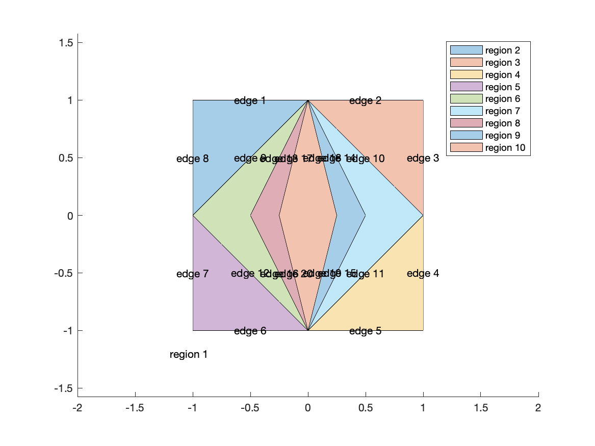
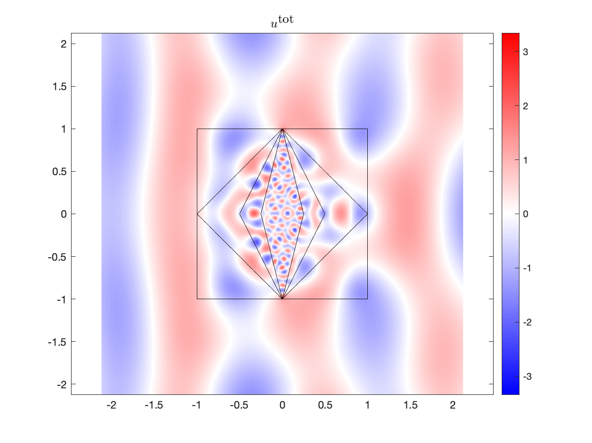

.. role:: matlab(code)
   :language: matlab   

Application to Transmission Problems with Multiple Junctions
=============================================================

It is easy to define time-harmonic acoustic and electromagnetic 
scattering problems
in piece-wise constant homogeneous media using a :matlab:`chunkgraph`
object and a helper routine available in `chunkie`. This includes domains
with multiple junctions and an arbitrary nesting of regions defining
the dielectric media. 
Suppose that the dielectric region consists of regions $\Omega_{j}$, 
$j=2,\ldots n_{r}$, and 
let $\Omega_{1} = \mathbb{R}^{2} \setminus \cup_{j=2}^{n_{r}} \overline{\Omega_{j}}$
denote the exterior region. Let $\varepsilon_{j}$ denote the permittivity
and let $k_{j}$ denote the wavenumber in $\Omega_{j}$. 
Let $\Gamma_{\ell}$, $\ell=1,2,\ldots n_{e}$ 
denote the edges (possibly curved) in the :matlab:`chunkgraph`, and let 
$r_{\ell,\pm}$ denote the index of the region numbers pointing in the positive
and negative normal direction to the edge respectively.

Consider the following domain consisting of $9$
dielectrics. We use the :matlab:`plot_regions` 
functionality of the :matlab:`chunkgraph` to identify its regions and edges.

.. include:: ../../chunkie/demo/demo_concentric_transmission.m
   :literal:
   :code: matlab
   :start-after: %% Build geometry
   :end-before: % END DOMAIN 

For electromagnetic scattering, in the transverse
electric or transverse magnetic mode, the potentials $u_{j}$
in $\Omega_{j}$, $j=1,\ldots n_{r}$ satisfy
the following transmission boundary value problem

.. math::

   \begin{align*}
   \Delta u_{j} + k_{j}^2 u_{j} &=0 & \textrm{ in } \Omega_{j} \; , j=1,2\ldots n_{r}\\
   u_{r_{\ell,+}} - u_{r_{\ell,-}} &= f_{\ell} & \textrm{ on } \Gamma_{\ell} \;, \ell=1,2,\ldots n_{e}\,, \\
   \beta_{r_{\ell,+}}\frac{\partial u_{r_{\ell,+}}}{\partial n} - \beta_{r_{\ell,-}}\frac{\partial u_{r_{\ell,-}}}{\partial n} &= g_{\ell} & \textrm{ on } \Gamma_{\ell}\;, \ell=1,2,\ldots n_{e}\,,\\
   \sqrt{|x|} \left( \frac{x}{|x|} \cdot \nabla u_{1} - ik_{1} u_{1} \right )
   &\to 0 & \textrm{ as } |x|\to \infty \;.
   \end{align*}

Here $\beta_{j} = 1$ for the transverse magnetic mode and 
$\beta_{j} = 1/\varepsilon_{j}$ for the transverse electric mode. 

A typical problem of interest is that of computing the scattered field 
from incident plane waves. In this case, the data $f_{\ell} = -e^{-ik x\cdot d}$ and
$g_{\ell} = (d\cdot n)e^{-ik x \cdot d}$ are non-zero if and only if they are exposed to the unbounded 
region, i.e. one of $r_{\ell,+}$ or $r_{\ell,-}$ is $1$, and $d$ here
is the direction of incidence of the plane wave. 

Let $G_{k}$ denote the Green's function for the Helmholtz equation
given by

.. math::

   G_{k}(x,y) = \frac{i}{4}H_{0}^{(1)}(k|x-y|)\;.

Recall that the single and and double layer potentials are given by

.. math::

   \begin{align*}
   [S_{k}\sigma](x) &:= \int_\Gamma G_k(x,y) \sigma(y) ds(y)\;,  \\
   [D_{k}\sigma](x) &:= \int_\Gamma n(y)\cdot \nabla_y G_k(x,y) \sigma(y) ds(y) \;,
   \end{align*}

where $\Gamma = \cup_{\ell=1}^{n_{e}} \Gamma_{\ell}$.

The potentials $u_{j}$ can then be defined in terms of the single 
and double layer potential operators as:

.. math::
   
   \begin{align*}
   u_{j}(x) &= \frac{1}{\beta_{j}}[D_{k_{j}}\sigma](x) - [S_{k_{j}}\mu](x) & \textrm{ in } \Omega_{j}\;,
   \end{align*}

Then, imposing the boundary conditions on this representation results
in the following equation for $\sigma, \mu$:

.. math::

   \begin{align*}
   \begin{bmatrix}
   \sigma\\
   \mu
   \end{bmatrix}
   + \gamma_{\ell}\begin{bmatrix} 
    (\beta_{r_{\ell,-}}D_{k_{r_{\ell,+}}} - \beta_{r_{\ell,+}}D_{k_{r_{\ell,-}}}) &
    -\beta_{r_{\ell,+}} \beta_{r_{\ell,-}}(S_{k_{r_{\ell,+}}} - S_{k_{r_{\ell,-}}}) \\
    (D'_{k_{r_{\ell,+}}} - D'_{k_{r_{\ell,-}}}) &
    -(\beta_{r_{\ell,+}}S'_{k_{r_{\ell,+}}} - \beta_{r_{\ell,-}}S'_{k_{r_{\ell,-}}})
   \end{bmatrix}
   \begin{bmatrix}
   \sigma\\
   \mu
   \end{bmatrix} &= 
   \gamma_{\ell}\begin{bmatrix}
   \beta_{r_{\ell,+}} \beta_{r_{\ell,-}}f_{\ell}\\
   g_{\ell}
   \end{bmatrix} \;\; \textrm{ on } \Gamma_{\ell}\;, 
   \end{align*}

for $\ell=1,2,\ldots n_{e}$ where $\gamma_{\ell} = \frac{2}{\beta_{r_{\ell,+}} + \beta_{r_{\ell,-}}}$.

.. note::
   Note the single and double layer, and the integral equation 
   are appropriately scaled to ensure that the integral equation 
   is of the form $(I + K)$ as opposed to $\alpha I + K$ for $\alpha \neq 1$. 
   The current implementation of the corner compression scheme, 
   RCIP, requires this scaling for solving integral equations on
   `chunkgraphs`. This restriction will soon be lifted in an upcoming release
   of :matlab:`chunkIE`, but is required as of the current version.

The :matlab:`chunkermat` routine is capable of handling such a problem
specification, in which the interaction varies for different
pairs of `chunkgraph` edges. These interactions can be specified as
a $n_{\textrm{edge}}\times n_{\textrm{edge}}$ matrix of `kernel` objects.

For transmission problems, we also provide a 
helper routine, :matlab:`chnk.helm2d.transmission_helper`, which
automates much of the process. This routine only requires the 
:matlab:`chunkgraph`, the wavenumbers $k_{j}$, the coefficients $\beta_{j}$
and the regions abutting edges $r_{\ell,\pm}$ which can be determined 
using the :matlab:`chunkgraph` routine, :matlab:`find_edge_regions`.
Given this information, the routine returns
the kernels for solving the integral equation, 
the boundary data for scattering from planewaves, and the
integral kernels needed to evaluate the solution in any region (for
postprocessing/plotting).
This simplifies the task of genertaing the system matrix quite a bit,
requiring only a few lines of code:

.. include:: ../../chunkie/demo/demo_concentric_transmission.m
   :literal:
   :code: matlab
   :start-after: %% Build system
   :end-before: % solve 

The solution can then be plotted in the bulk using :matlab:`chunkerkerneval`
and the :matlab:`kerns_eval` matrix of kernels:

.. include:: ../../chunkie/demo/demo_concentric_transmission.m
   :literal:
   :code: matlab
   :start-after: %% Compute field 
   :end-before: % END TRANSMISSION PROBLEM 

