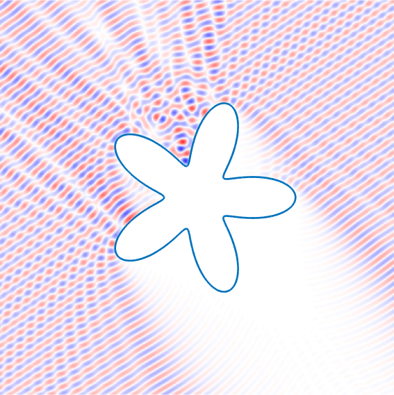

.. chunkie documentation master file, created by
   sphinx-quickstart on Tue Apr 28 21:16:39 2020.
   You can adapt this file completely to your liking, but it should at least
   contain the root `toctree` directive.

.. role:: matlab(code)
   :language: matlab   

chunkie
==========

	   

chunkie is a MATLAB package for solving partial differential
equations in two dimensional domains. The name "chunkie" derives
from the use of chunks (panels with scaled Legendre nodes) to
discretize the domain boundary and the use of an integral equation
method to solve the PDE.

With chunkie, you can solve the Helmholtz equation on an exterior
domain in a few lines of MATLAB. The code below defines and solves
a scattering problem, producing the image above:

.. code:: matlab

   % planewave definitions

   kvec = 20*[1;-1.5];
   zk = norm(kvec);
   planewave = @(kvec,r) exp(1i*sum(bsxfun(@times,kvec(:),r(:,:)))).';

   % discretize domain

   chnkr = chunkerfunc(@(t) starfish(t,narms,amp),struct('maxchunklen',4/zk)); 
   
   % build CFIE and solve
   
   fkern = kernel('helm','c',zk,[1,-zk*1i]);
   sysmat = chunkermat(chnkr,fkern);
   sysmat = 0.5*eye(chnkr.k*chnkr.nch) + sysmat;
   
   rhs = -planewave(kvec(:),chnkr.r(:,:));
   sol = gmres(sysmat,rhs,[],1e-13,100);

   % evaluate at targets

   x1 = linspace(-3,3,400);
   [xxtarg,yytarg] = meshgrid(x1,x1);
   targets = [xxtarg(:).';yytarg(:).'];
   
   in = chunkerinterior(chnkr,targets);
   out = ~in;

   uscat = chunkerkerneval(chnkr,fkern,sol,targets(:,out));

   uin = planewave(kvec,targets(:,out));
   utot = uscat(:)+planewave(kvec,targets(:,out));

   % plot 

   maxu = max(abs(utot(:)));
   figure()
   zztarg = nan(size(xxtarg));
   zztarg(out) = utot;
   h=pcolor(xxtarg,yytarg,imag(zztarg));
   set(h,'EdgeColor','none')
   hold on
   plot(chnkr,'LineWidth',2)
   axis equal tight
   colormap(redblue)
   caxis([-maxu,maxu])

Features
--------

- easy-to-use: most chunkie functionality only requires that
  you specify two things, the geometry (as a "chunker" object)
  and the integral kernel (as a "kernel" object). The distribution
  includes pre-defined kernels for the Laplace, Helmholtz,
  and Stokes PDEs and convenient tools for visualizing domains
  and plotting solutions.
- capable: chunkie uses high order accurate quadrature rules
  and fast algorithms to provide accurate solutions with linear
  scaling. The chunkie utilities can be used to solve singular
  problems on domains with corners and multiple material junctions
  with relative ease.
- flexible: allows you to define your own integral kernels and
  use the quadrature routines in a modular fashion.

How to Get Chunkie
-------------------

- `Get chunkie <getchunkie.html>`_ (includes installation instructions
  and troubleshooting guide)
- `Source Code <https://github.com/fastalgorithms/chunkie>`_

  
Using Chunkie
----------------

The `chunkie guide <guide.html>`_
provides an overview of the chunkie approach to PDEs and a detailed
look at chunkie's capabilities.

Gallery
--------

The `gallery <gallery.html>`_ has examples of chunkie applications
submitted by users.

Contributing
------------

We welcome your collaboration! First, see the
`developer guide <https://github.com/fastalgorithms/chunkie/wiki>`_.

- `Issue Tracker <https://github.com/fastalgorithms/chunkie/issues>`_
- `Source Code <https://github.com/fastalgorithms/chunkie>`_

License
-------

The project is licensed under a modified BSD 3-clause
license.

.. toctree::
   :maxdepth: 1
   :caption: Contents

   getchunkie
   guide
   gallery
   kerns
   

